## Изучите [README.md](README.md) файл и структуру проекта.

## Задание 1

1. Спроектируйте to be архитектуру КиноБездны, разделив всю систему на отдельные домены и организовав интеграционное взаимодействие и единую точку вызова сервисов.
Результат представьте в виде контейнерной диаграммы в нотации С4.
Добавьте ссылку на файл в этот шаблон
[ссылка на файл](ссылка)


## Задание 2
### Формулировки подзаданий
**1. Proxy**
> Команда КиноБездны уже выделила сервис метаданных о фильмах movies и вам необходимо реализовать бесшовный переход с применением паттерна Strangler Fig в части реализации прокси-сервиса (API Gateway), с помощью которого можно будет постепенно переключать траффик, используя фиче-флаг.
> Реализуйте сервис на любом языке программирования в ./src/microservices/proxy.
> Конфигурация для запуска сервиса через docker-compose уже добавлена

**2. Kafka**
> Вам как архитектуру нужно также проверить гипотезу насколько просто реализовать применение Kafka в данной архитектуре.
> Для этого нужно сделать MVP сервис events, который будет при вызове API создавать и сам же читать сообщения в топике Kafka.
>    - Разработайте сервис на любом языке программирования с consumer'ами и producer'ами.
>    - Реализуйте простой API, при вызове которого будут создаваться события User/Payment/Movie и обрабатываться внутри сервиса с записью в лог
>    - Добавьте в docker-compose новый сервис, kafka там уже есть

### Шаги выполнения заданий
1. Реализован сервис [proxy](src/microservices/proxy) на java:
   - поток `api/movies` разделяет между [monolith](src/monolith) и [movies-service](src/microservices/movies);
   - поток `api/events` целиком идет на [events-service](src/microservices/events);
   - остальные запросы, которые должно поддерживать внешнее API - идут на монолит;

2. Реализован сервис [events](src/microservices/events) на java:
   - который обрабатывает POST запросы путем записи эвентов в kafka;
   - и сам же выступает консюмером kafka;
   - события отправки в kafka и чтения из kafka пишутся в логи;
- После реализации запустите postman тесты - они все должны быть зеленые.

3. Запуск контейнеров через docker-compose:
   - примечание: по какой-то причине монолит не всегда стартует с 1 раза.

4. Проверки
 - запуск api тестов в docker:
   - 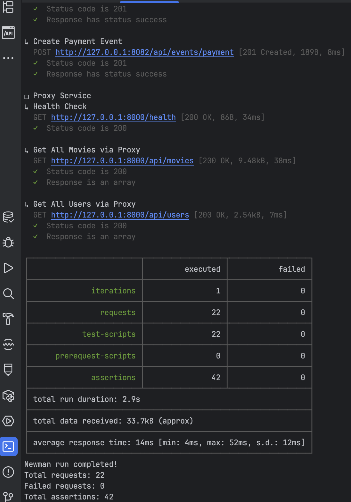 
 - отправка запросов к http://localhost:8000/api/movies и отслеживание по логам направления в proxy-service (с настрофками 25% к movies-service):
   - 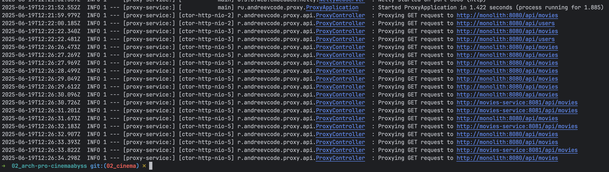 
 - логи по kafka для `events-service`:
   - 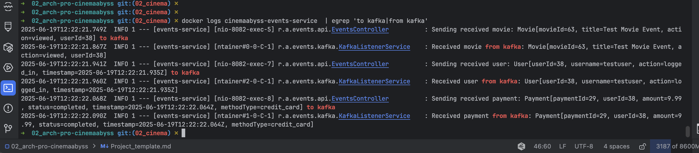
 - состояние топиков в `kafka-ui`:
   - 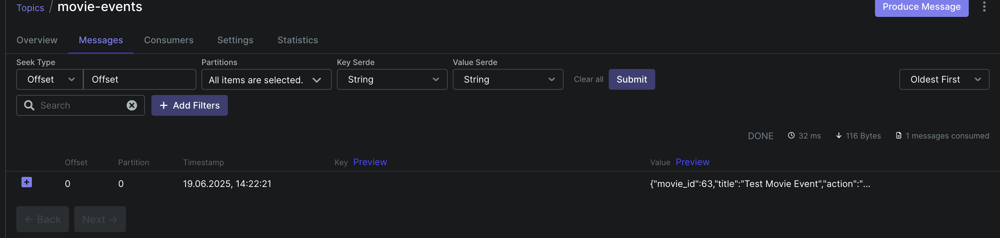
   - 
   - 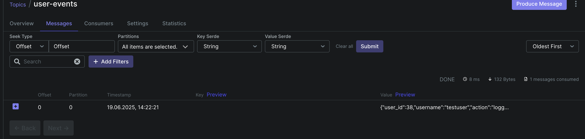


## Задание 3
>Команда начала переезд в Kubernetes для лучшего масштабирования и повышения надежности. 
Вам, как архитектору осталось самое сложное:
> - реализовать CI/CD для сборки прокси сервиса
> - реализовать необходимые конфигурационные файлы для переключения трафика.


### 3.1 CI/CD
**Шаги выполнения задания**
 - В папке `.github/worflows` доработан [docker-build-push.yml](.github/workflows/docker-build-push.yml) для новых сервисов proxy и events;
    - в том числе добавлена возможность запуска на arm чипах apple: `platforms: linux/amd64,linux/arm64`;
 - при создании/обновлении ПР теперь отрабатывают две джобы `github actions`:
   - сборка запуск api тестов;
   - сборка и деплой docker образов в `ghcr.io`;
   
**Где ваши доказательства?**
- зеленые `github actions`: 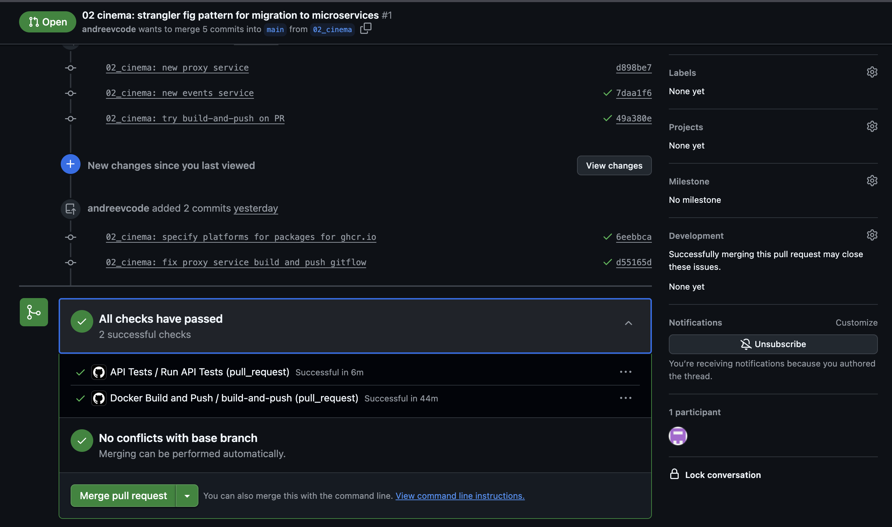
- выгруженные пакеты: 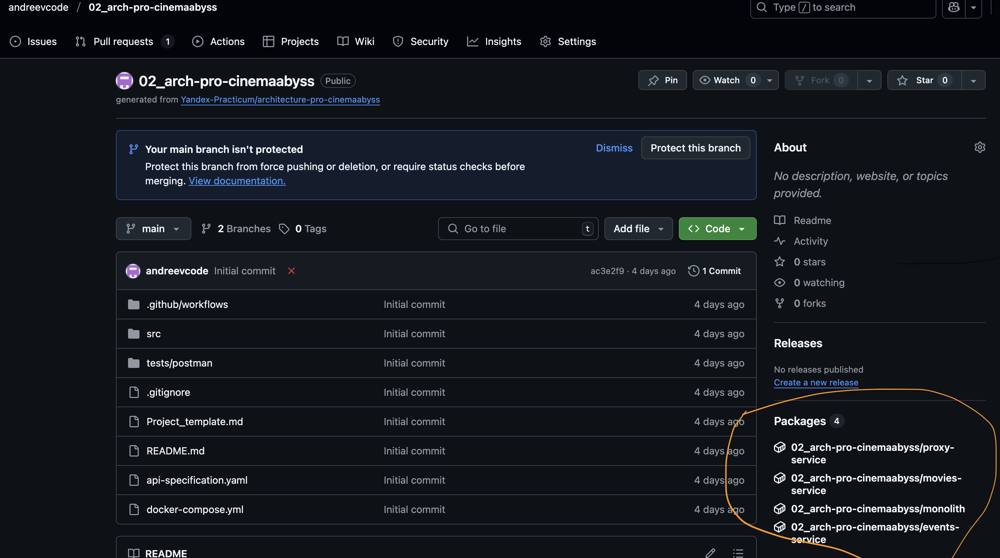


### 3.2 Proxy в Kubernetes
 **Шаги выполнения задания**
1. Запуск кластера в соответствии с инструкцией отсюда.
 - установлены kubectl и minikube со всеми зависимостями;
 - пакеты выгружены в регистри гитхаба во время ПР, настроен токен для доступа к пакетам;
 - доработаны конфиги кубернетеса, в частности:
   - секрет с токеном [dockerconfigsecret.yaml](src/kubernetes/dockerconfigsecret.yaml);
   - deployment [events-service.yaml](src/kubernetes/events-service.yaml) и [proxy-service.yaml](src/kubernetes/proxy-service.yaml);
   - [ingress.yaml](src/kubernetes/ingress.yaml);
   - обновлен `etc/hosts`: 127.0.0.1 cinemaabyss.example.com;
 - приложения запущены в кластере кубернетиса через minikube, включен ingress;
 - настроен `minikube tunnel`;

2. Ручной прогон в постмане запроса из задания (_Вызовите https://cinemaabyss.example.com/api/movies_) и других запросов:
  - 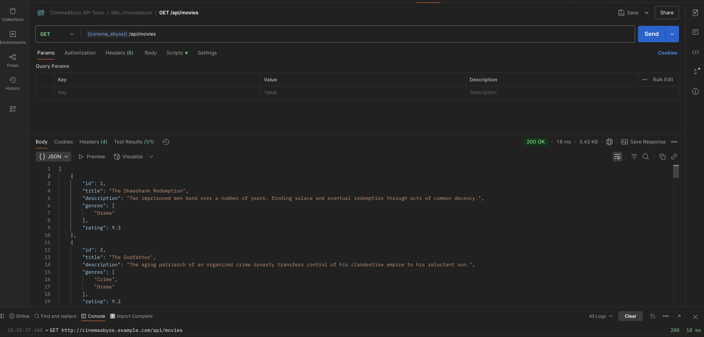

3. Запуск тестов из папки tests/postman `npm run test:kubernetes`
 - логи тестов: 
   - 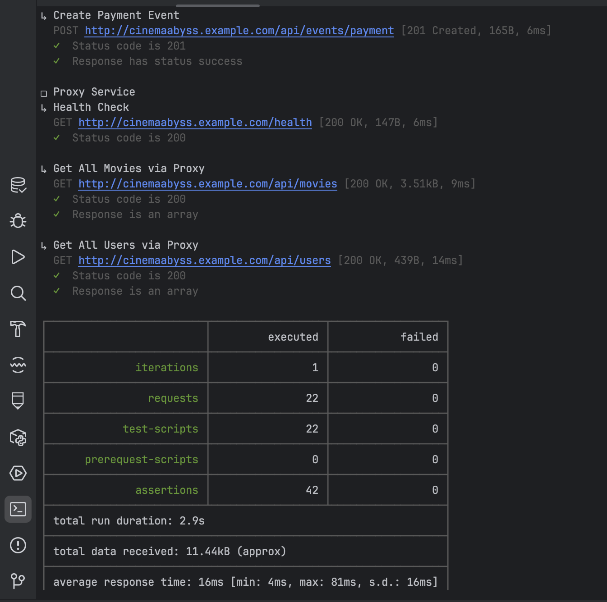
 - логи event-service, где запросы `api/events/movie, api/events/payment, api/events/user` должны были:
   - попасть через proxy в `event-service`;
   - отправиться в kafka;
   - обработаться из kafka;
     - 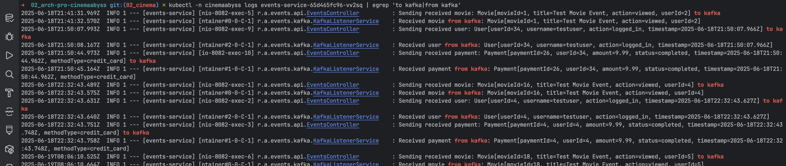

## Задание 4
> Для простоты дальнейшего обновления и развертывания вам как архитектуру необходимо так же реализовать helm-чарты для прокси-сервиса и проверить работу 

**Шаги выполнения задания**
1. Подготовка конфигураций
   - в values.yaml исправлены пути к регистри и добавлен секрет с токеном;
   - сделаны шаблоны для proxy-service.yaml и events-service.yaml по аналогии с обычными deployment конфигами для кубернетеса;
   - исправление бага [configmap.yaml](src/kubernetes/helm/templates/configmap.yaml) c путем movies-service;

2. Запуск
 - удаление ручной инсталляции кубернетеса;
```bash
kubectl delete all --all -n cinemaabyss
kubectl delete  namespace cinemaabyss
```
- развертывание helm-чарта `helm install cinemaabyss .\src\kubernetes\helm --namespace cinemaabyss --create-namespace`
- найден правка бага

3. Проверки развертывания:
```bash
kubectl get pods -n cinemaabyss
minikube tunnel
```
- развертывание и состояние кластера:
  - 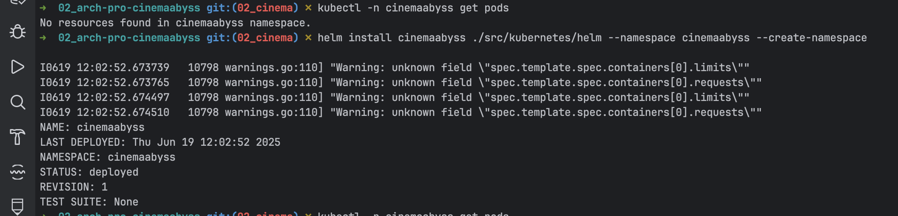
  - 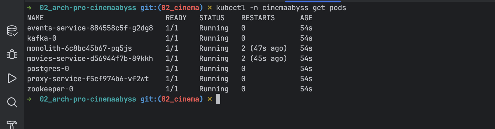
- ручная проверка в postman:
  - 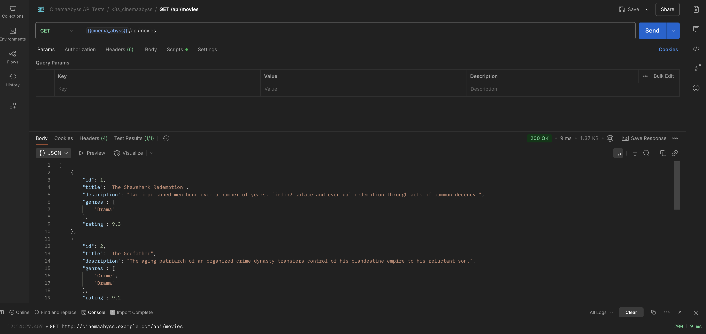


# Задание 5
> Компания планирует активно развиваться и для повышения надежности, безопасности, реализации сетевых паттернов типа Circuit Breaker и канареечного деплоя вам как архитектору необходимо развернуть istio и настроить circuit breaker для monolith и movies сервисов.

**Шаги выполнения задания**
1. Подготовка.
- конфиг для будущего запуска на envoy-сайдкаре [circuit-braker-config.yaml](src/kubernetes/circuit-braker-config.yaml)
- установка istio, прописывание его для namespace=cinemaabyss
- затем рестарт релиза для namespace=cinemaabyss, чтобы сайдкары подтянулись
- и применение конфига circuit-braker;
    ```bash
    helm repo add istio https://istio-release.storage.googleapis.com/charts
    helm repo update
    
    helm install istio-base istio/base -n istio-system --set defaultRevision=default --create-namespace
    helm install istio-ingressgateway istio/gateway -n istio-system
    helm install istiod istio/istiod -n istio-system --wait
    
    helm install cinemaabyss ./src/kubernetes/helm --namespace cinemaabyss --create-namespace
    
    kubectl label namespace cinemaabyss istio-injection=enabled --overwrite
    
    kubectl get namespace -L istio-injection
    
    -- рестарт
    kubectl rollout restart deployment -n cinemaabyss 
    
    kubectl apply -f .\src\kubernetes\circuit-breaker-config.yaml -n cinemaabyss
    ```

2. Тестирование
- установка fortio - инструмента для нагрузочного тестирования; 
  - `kubectl apply -f https://raw.githubusercontent.com/istio/istio/release-1.25/samples/httpbin/sample-client/fortio-deploy.yaml -n cinemaabyss`

- получить имя пода fortio, и далее его использовать для запуска тестов:
  - `FORTIO_POD=$(kubectl get pod -n cinemaabyss | grep fortio | awk '{print $1}')`
- запуск нагрузочного тестирования:
  - `kubectl exec -n cinemaabyss $FORTIO_POD -c fortio -- fortio load -c 50 -qps 0 -n 500 -loglevel Warning http://movies-service:8081/api/movies`
3. Сбор результатов:
- из вывода команды запуска тестирования;
- а также дополнительно просмотреть статистику через pilot-agent:
  - `kubectl exec -n cinemaabyss fortio-deploy-b6757cbbb-7c9qg -c istio-proxy -- pilot-agent request GET stats | grep movies-service | grep pending`
4. Итоги:
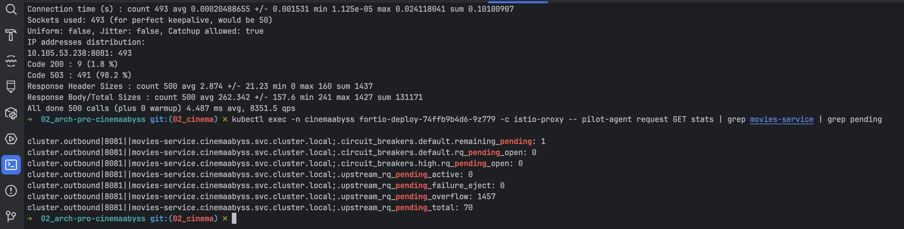
